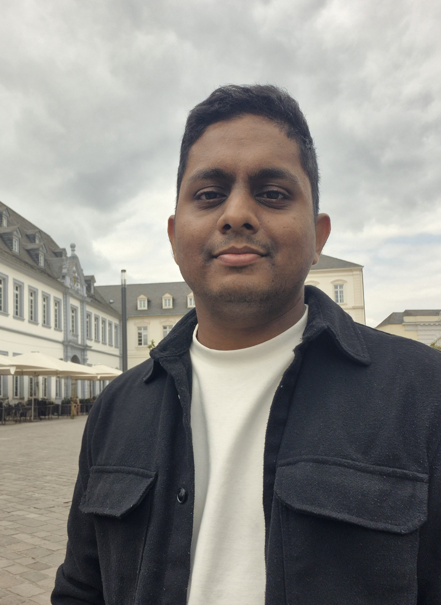

# Terril Joel Nazareth

  

    

    

      

        
        

          
Data Science & Data Engineering

          

            Data Science Student | Microsoft Certified | Data + ML + Engineering
          

        

      

      

        <a class="btn" href="https://github.com/terriljoel" target="_blank" rel="noreferrer">GitHub</a>
        <a class="btn" href="https://www.linkedin.com/in/terril-joel-nazareth-298516191" target="_blank" rel="noreferrer">LinkedIn</a>
        <a class="btn btn-outline" href="mailto:terriljoel@gmail.com">Email</a>
      

    

  

---

## About Me
I am a Data Science / Data Engineering-focused student based in Braunschweig, Germany. I build practical data products, from pipelines and analytics layers to ML workflows, with a focus on performance, scalability, and maintainability.

**Current interests:**  ML pipelines - Data Engineering - Software Engineering

---

## Skills
- **Programming Languages:** C, C++, Python, SQL
- **ML/DS:** scikit-learn, PyTorch, Hugging Face Transformers, model evaluation, hyperparameter tuning
- **Data Engineering:** Azure Data Factory, Databricks, PySpark, Delta/Medallion architecture, Data Warehousing
- **Cloud:** Azure (Functions, Logic Apps, Data Lake Gen2, DevOps), AWS (SageMaker, S3, Lambda, CloudWatch)
- **BI/Tools:** Power BI, Git, VS Code, SSMS

---

## Education
### Technical University of Braunschweig (Braunschweig, Germany)
*Master of Science in Data Science - Oct 2023 – Present (5th Semester)*

### NMAM Institute of Technology (Nitte, India)
*Bachelor of Engineering in Computer Science and Engineering - Aug 2016 – Aug 2020*

---

## Languages
- German (A2)
- English (Fluent)
- Hindi (Fluent)
- Kannada (Fluent)
- Konkani (Native)
- Tulu (Native)

---

## Explore More
- **[Experience](experience.md)** - Professional and academic roles.
- **[Projects](projects.md)** - Personal project work.
- **[Certifications](certifications.md)** - Professional certifications and credentials.
